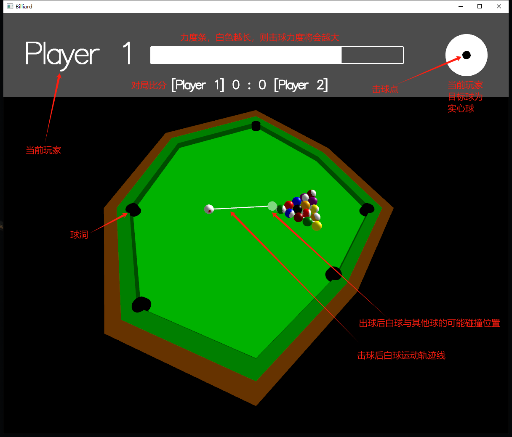
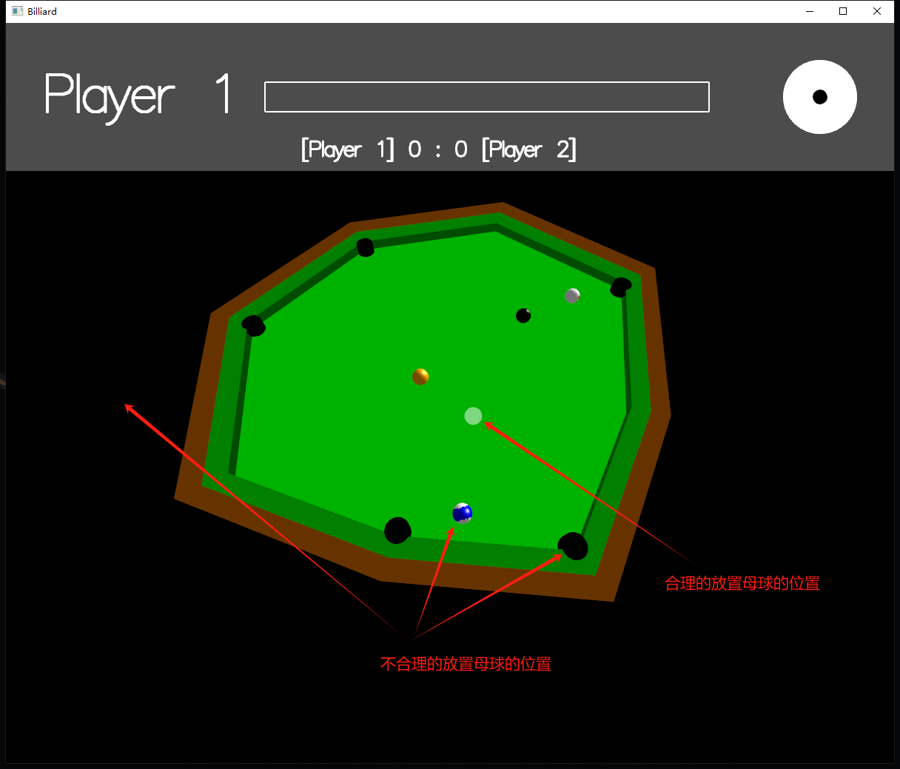
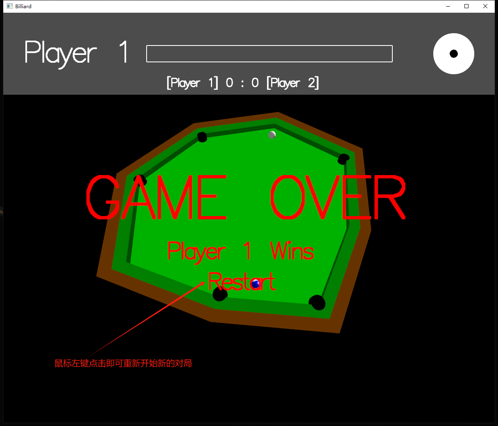
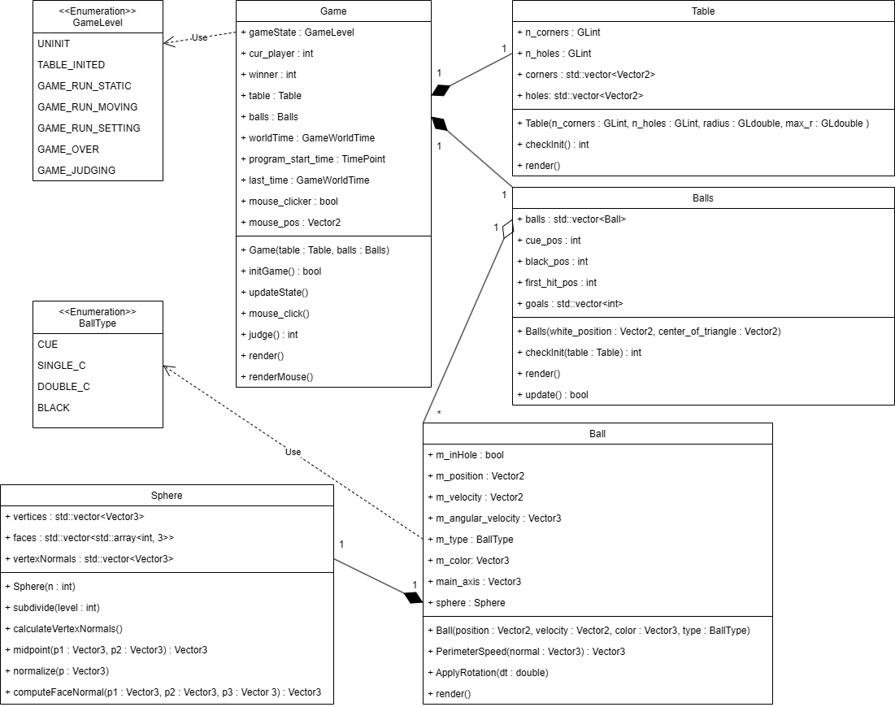

# 基于OpenGL的多边形台球游戏

## 摘要

传统的台球游戏通常使用矩形台桌，但我们的任务是利用OpenGL技术创建一个具有多边形台球桌的游戏。我们采用了OpenGL作为图形实现平台，并且使用了SDL库作为音效实现平台。首先，我们实现了一个随机生成多边形的算法，用于创建具有不同形状和大小的台球桌，确保生成的台球桌具有足够的复杂性和多样性。然后，我们利用OpenGL绘制了多边形台桌，并在其上放置了台球、球袋和其他游戏元素。我们还实现了物理引擎来模拟台球的运动和碰撞，以及简易的用户界面来控制游戏流程和玩家操作。玩家可以通过用户界面进行游戏操作，台球在台球桌上的运动和碰撞符合物理规律，并且具有良好的游戏体验和可玩性。

我们的台球游戏具有如下功能特性：

- 简易的8台球游戏规则

- 带加塞的击球
- 台球进洞评判
- 击球音效
- 对局胜负计分
- 逼真的物理引擎
- 友好的用户界面
- 光照效果与3D场景

我们的项目代码已开源在[Github](https://github.com/DylanWRh/Billiard-OpenGL)。

## 安装与运行

### 环境

- Windows
- Visual Studio 2022 + nupengl package
- OpenGL库：[GLUT](https://www.opengl.org/resources/libraries/glut/glutdlls37beta.zip) GLFW GLAD
- [SDL](https://www.libsdl.org/)

### 安装

在满足上述环境的要求下，即将OpenGL与SDL的lib链接至本项目，编译后将相应的dll放在可执行文件所在的文件夹下后即可运行。

### 交互

下图为进入游戏后的主界面

可交互点包括：

- 使用鼠标左键点击右上角目标球内的区域，可以改变击球点位置实现加塞。
- 当对局还未结束且球均静止时，将鼠标悬停于下方场景，击杆方向将会是从目标球指向鼠标的方向。当母球未来的运动轨迹将会与其他球相撞时，将会产生白色的引导线与半透明的白球，代表白球未来的碰撞方向。注意，预测的运动轨迹不考虑撞库与加塞造成的旋转。鼠标所指向的场景位置离母球越远，则未来击球的力度也会越大。
- 当犯规出现时，对手将会获得自由击球。将鼠标置于台桌之上时，将会显示半透明的白球。当半透明白球位置合理时（无其他球遮挡、不在袋口上等），点击鼠标左键，将会放置母球。
- 当对局还未结束且球均静止时，在下方场景中按下鼠标左键，将会以设置的击球点击打母球。
- 在下方场景中按下鼠标右键，将会切换不同视角模式，一种是固定俯视视角，一种是可调远近与方向的视角。
- 当处于可调远近与方向的视角模式时，可使用键盘上下左右键调整视角方向，同时也可使用鼠标滚轮拉近或放远视角。
- 游戏结束时，使用鼠标左键点击Restart即可重新开始新的对局。

犯规发生时：

游戏结束时：

## 框架

对项目系统进行了简易的面向对象分析建模，下图为项目设计的核心类图：

### 类

#### Game类

##### 作用

负责存储游戏状态、状态更新。状态包括多边形球桌实例、球类实例、玩家状态、世界时间等。同时也存储了外界用户与游戏进行交互时的数据结构，例如鼠标位置、加塞位置等。

##### 行为

- 初始化游戏。对应于函数`initGame` ，将会为实例化时传入的多边形顶点数量与球洞数量进行球桌随机生成与球的摆放。
- 更新状态。对应于函数`updateState` ，这个函数在每帧都会得到调用，以更新球的位置与速度等属性、检测对局状态。
- 处理用户鼠标事件。对应于函数`mouse_click` ，当合理的鼠标调用被OpenGL框架捕获时，将会调用这个方法，处理来自于外界用户的鼠标事件对游戏状态的影响，例如击球、重新开始对局等。
- 检测对局是否结束以及状态。对应于函数`judge` ，如果想要获得最新的对局状态，例如是否结束等，可以调用此函数更新成员数据以及返回枚举结果。
- 绘制。对应于`render` `renderMouse` ，前者调用其球桌实例、球类实例等成员的绘制函数，后者可以实现白球轨迹线的绘制。

#### Table类

##### 作用

存放着多边形台球桌的属性信息，包括桌角位置、球洞位置等。

##### 行为

- 检测是否初始化成功。对应于函数`checkInit` 多边形台球桌具有一定复杂性，可能会初始化异常，可以通过预先的规则检查球桌是否被正确或合理地初始化了。
- 绘制。对应于函数`render` 。供Game类进行调用，实现3D球桌的绘制。

#### Balls类

##### 作用

存放所有球的实例。负责球体绘制的实现。

##### 行为

- 检测是否初始化成功。对应于函数`checkInit` 多边形台球桌具有一定复杂性，可能会初始化异常，可以通过预先的规则检查球的摆放位置是否正确、合理。
- 绘制。对应于函数`render` 。供Game类进行调用，调用所有球成员的绘制函数。
- 状态更新。对应于函数`update` ，处理球与世界中物体之间摩擦与碰撞的物理模拟。

#### Ball类

##### 作用

存放着一个特定球的实例的特质信息，例如球的种类、球的物理状态等。

##### 行为：

- 计算角速度造成的表面某点的旋转线速度。对应于函数`PerimeterSpeed` 。在计算球体旋转造成的滑动、滚动、碰撞拟真时被频繁调用。
- 旋转球。通过将角速度在dt时间内造成的旋转作用于球的主轴向量`main_axis` ，从而改变球的绘制效果。

- 绘制。对应于函数`render` 。供Balls类进行调用，是实现3D球的具体实现。

### 源文件

#### 类的实现文件

game.* , Table.* , Balls.* , Ball.* , Sphere.*

#### 其他功能实现源文件

- SDL音效

  `sound_stuff.*` 、rawdata文件夹下的cpp文件，用于实现SDL音效的初始化与播放。rawdata文件夹下存放的是音效的二进制流。

- 数学工具

  `math_utils.*` ，用于实现使用到的数学函数与数据结构，例如`Vector2` ` Vector3` ，判断点是否在多边形内部等。

- 绘制工具

  `render_utils.*` ，用于包装一些简单图形的绘制。

- 其他工具

  `utils.*` ，例如错误I/O函数、Debug I/O函数、时间计算、随机数产生等。

- 宏定义

  `defs.h` ，包括物理拟真常数、尺寸等。

  

## 方法细节

### 3D绘制

- 桌面的绘制使用空间多边形绘制而成

- 球体的绘制使用HW4中实现的可使用于Phong模型进行光照渲染的方法，使用一个类Sphere存储细分四面体后的点法向和面的点索引，每一个球体有一个主轴。
  
  - **Note：**对于双色球，将法向与主轴的余弦绝对值大于一定阈值的面设置为白色实现双色效果。

### 物理仿真

完整的台球游戏项目离不开对逼真的物理仿真。对于球类，我们设定了速度、角速度、旋转、位移，并且按照现实世界设定了相应的物理属性例如质量等。我们使用到的基本物理公式有：

#### 球面上某点线速度

$\vec{v{_{a}}} = \vec{v}+ (\vec{up} \times R\vec{\omega})$

#### 滑动摩擦建模

	  
$\dot{v} = -\mu g \dfrac{\vec{v_{a}}}{\left | \vec{v_{a}} \right |}$

$\dot{w} = -\frac{5}{2}\frac{\mu g}{R} \dfrac{\vec{v_{a}}}{\left | \vec{v_{a}} \right |}$

$\dot{\omega}_{z} = -\dfrac{5}{2}\dfrac{M_{z}}{mR^2}sgn(\omega_{z})$

#### 滚动摩擦建模

$\dot{v} = -\dfrac{5}{7}\dfrac{M_{xy}}{mR}\dfrac{\vec{up}\times\vec{\omega}}{\left | \vec{w} \right |}$

$\dot{w} = -\dfrac{5}{7}\dfrac{M_{xy}}{mR^2}\dfrac{\vec{\omega}}{\left | \vec{w} \right |}$

where

$M_{xy}=\dfrac{7}{5\sqrt{2}}R\mu mg$

$M_{z}=\dfrac{2}{3}\mu mg\rho$

以上是可能使用到物理公式（Based on [Han 2005](https://billiards.colostate.edu/physics_articles/Han_paper.pdf) paper）。实际上对上述公式，我们可能对其进行了部分简化。以及除了上述公式之外，我们还对于某些情况进行了简化建模。例如对于球与库之间的碰撞，我们将由于球面与库之间产生相对位移而造成的速度沿库边方向进行变化进行了简单的建模。具体来说，速度变化量正比于速度垂直撞击库的分量大小，正比于球面与库之间产生相对速度的大小。

## 分工

总体来说，完美五五开。

- 3D场景建模：王瑞环
- 物理拟真：罗力勤
- 音效实现：罗力勤
- 游戏规则实现：王瑞环
- 用户交互设计：王瑞环、罗力勤
- 程序整体框架设计：罗力勤（初期设计）、王瑞环（扩充与重构）
- 项目文档：罗力勤、王瑞环